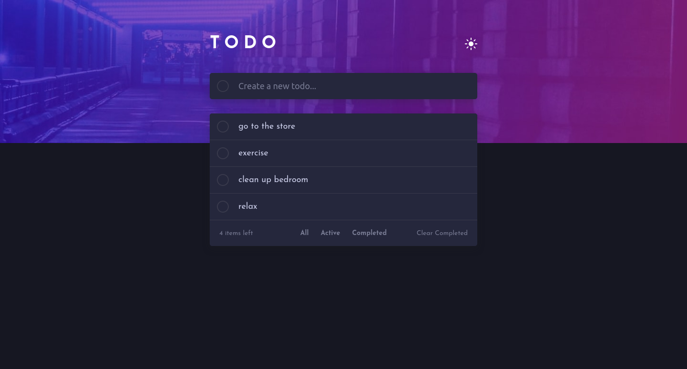

### Screenshot

## The challenge

Your challenge is to build out this todo app and get it looking as close to the design as possible.

You can use any tools you like to help you complete the challenge. So if you've got something you'd like to practice, feel free to give it a go.

Your users should be able to:

-   View the optimal layout for the app depending on their device's screen size
-   See hover states for all interactive elements on the page
-   Add new todos to the list
-   Mark todos as complete
-   Delete todos from the list
-   Filter by all/active/complete todos
-   Clear all completed todos
-   Toggle light and dark mode
-   **Bonus**: Drag and drop to reorder items on the list

### Links

-   Solution URL: [Add solution URL here](https://your-solution-url.com)
-   Live Site URL: [Add live site URL here](https://your-live-site-url.com)

## My process

### Built with

-   Mobile-first workflow
-   scss
-   [sortable javaScript library](https://cdnjs.com/libraries/Sortable)

### What I learned

I learned a lot about appending and removing elements with javaScript
I also used filter() method in a project for the first time

### Useful resources

-   [how to made gradient borders](https://codyhouse.co/nuggets/css-gradient-borders)
-   [how to make a line go through multiple lines of text](https://developer.mozilla.org/en-US/docs/Web/CSS/text-decoration-line)
-   [sortable HTML using cdnjs.com](https://www.youtube.com/watch?v=z54suepKiIU)
